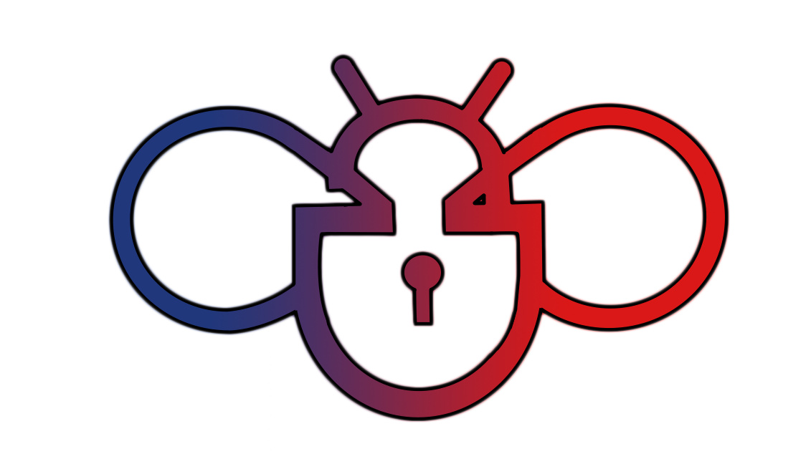

# itshmeluritybot

This is **IT-Shmelurity** Telegram Bot for post automation<br /> 


## Install app

itshmeluritybot requires `docker` to run.

Clone repo
```shell
git clone https://github.com/3ayazaya/itshmeluritybot.git
cd itshmeluritybot
```

Create **.env** file
```shell
touch .env
```

Configure **.env** file

```shell
vim .env
```
Paste and configure
```
TOKEN='<TELEGRAM_BOT_TOKEN>'
DB_USER='DATABASE_USERNAME'
DB_HOST='DATABASE_HOST_IP'
DATABASE='DATABASE_NAME'
DB_PASSWORD='DATABASE_PASSWORD'
DB_PORT=<DATABASE_PORT>
CHANNEL_ID="TELEGRAM_CHANNEL_CHAT_ID"
```

## Build app
Set **env**
```shell
set -a
source .env
```
Build app with _docker
```shell
docker build . -t <YOUR_DOCKER_IMAGE_TAG>
```

## Run app
Running app with _docker
```shell
docker run --name=<YOUR_CONTAINER_NAME> -d <YOUR_DOCKER_IMAGE_TAG>
```